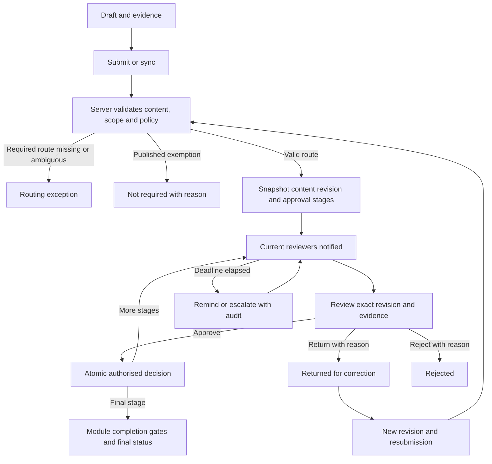

# Approval Matrix: correction and implementation plan

Review date: 10 September 2026. Scope: production web source under `src/`, primary Flutter mobile source, and read-only inspection of the live Tyre_pulse Supabase database. This is a proposed implementation plan, not a statement that the proposed capabilities already exist.

**Recommendation**

Make Approval Matrix the governed routing configuration for a shared server approval service. Both web and Flutter must display the same route, eligible reviewers, stage, evidence requirements and decision history. Reuse the existing workflow infrastructure and preserve each module's business checks.

The current page is a basic rule editor and matching preview. It is not yet a verified, end-to-end approval authority. The live matrix contained zero rows at review time. Adding rows alone would not connect it to the reviewed decision paths.

**What was verified**

- Live `approval_matrix` columns, constraints, RLS policy modes, grants, trigger, aggregate rule count and `resolve_approvers` definition.
- Live inspection/checklist decision functions and checklist stage guard.
- Live workflow/delegation columns, workflow launch function, escalation function and scheduled escalation job.
- Web matrix page, API, pure matching helpers and existing matrix tests; related web approval adapters.
- Flutter inspection and checklist repositories, checklist decision queue and retry logic. Local uncommitted changes were preserved.

No production writes, deployments or application changes were made. This was source/schema review, not an authenticated browser walkthrough, device run or adversarial execution test. Application tests and builds were not run for this planning document. Live findings describe this review's database snapshot; source findings describe the current workspace and do not establish what frontend build is deployed.

**Findings and corrections, in priority order**

| Priority | Verified finding | Required correction |
|---|---|---|
| P0 | The only live public function found referencing `approval_matrix` was `resolve_approvers`. Source references to the resolver were confined to matrix administration/preview and helpers/tests. Inspection and checklist decisions use separate logic. | Connect routing at submission and enforce the selected route at decision time. Show each module as Legacy, Pilot or Enforced until its integration is proven. Do not describe preview output as guaranteed execution before this exists. |
| P0 | Web checklist decisions call `decide_checklist_approval`; Flutter directly updates status, signer identity, signature and device time, with a prior-status guard. | Move Flutter decisions to the same guarded server contract. Derive actor and accepted timestamp server-side; preserve client capture time separately. Keep offline evidence persistence. |
| P0 | The live inspection decision function checks a fixed role allow-list and organisation, not the matrix. Its body does not require a signature or rejection reason. Its failure lookup reads an inspection by ID without repeating the organisation predicate. | Enforce route eligibility, required evidence, decision reason and scope on the server; scope error lookups too. Verify surrounding triggers/helpers before concluding exploitability. Preserve legitimate operational roles during rollout. |
| P1 | The page says named-person rules beat site rules, which beat role rules. Actual matching counts non-null fields, then sorts by level, specificity and creation time. A user-only rule can lose to a country+site rule. | Adopt a documented resolver contract. Recommended: explicit priority, then specificity, with ambiguous ties blocked at publication. Explain winning and excluded rules. Do not silently reinterpret existing published routes. |
| P1 | The resolver returns every matching rule, including fallback and specific rules at the same level. It does not select one winning route or define all/any semantics. | Select one applicable policy and its ordered stages. Within each stage explicitly configure named reviewer, any eligible member, all named members, or a defined quorum. Initially support named/any and sequential stages; add quorum only with complete concurrency tests. |
| P1 | Matrix web access is Admin-only; database writes use `app_is_elevated()` which includes admin, manager and director. Organisation isolation is RESTRICTIVE; delete also has a restrictive admin guard. | Align database and UI with explicit configuration permissions. Preserve restrictive tenant isolation. This is a role-policy mismatch, not evidence of unrestricted cross-tenant matrix access. Test locked users and inactive membership as well as role checks. |
| P1 | The form exposes role approvers but no named-person picker or submitting-person condition, although the schema supports both. Preview has no submitting-user input and displays named approvers generically. | Add searchable, tenant-scoped people pickers; show name, role, site and eligibility. Include submitting user in simulation. Do not ask administrators to enter UUIDs. |
| P1 | The form offers levels 1–3; validator/database allow 1–5. Site choices are deduplicated names and are not constrained by the chosen country. | Use one supported stage limit across clients/server. Select real scoped sites and stable identifiers through an explicit migration if needed; validate country/site relationships. |
| P1 | Matrix escalation stores days. The live hourly job reads workflow step `sla_hours` and notifies admin after logging escalation; it does not consume matrix days or reassign a reviewer. | Define and connect SLA settings, reminders and explicit escalation targets. Distinguish notification from reassignment. Never skip a mandatory approval merely because its SLA elapsed. |
| P1 | Matrix rows are directly editable/deletable. The inspected table has timestamps and an updated-at trigger, but no version lifecycle or matrix history trigger. | Add draft, review, publish, effective date and retirement. Retain immutable published versions and change events. Archive referenced rules; require a reason and impact preview. Verify any wider audit mechanisms before migration. |
| P1 | Missing matrix/backend relations are converted to an empty result. Site/role lookup failures silently fall back. Empty-state copy and no-match copy describe different consequences. | Separate not configured, backend unavailable, permission denied, partial data and genuine empty results. Display the actual module enforcement mode. A failed lookup must not allow publishing unverified routing. |
| P1 | Flutter retries recheck the current checklist stage and guard prior status, but do not bind the decision to an immutable content revision. The local dedupe key uses submission ID and target status. | Bind decisions to content revision, stage instance and a unique operation ID. Same-status content edits and return/resubmit cycles must invalidate stale signatures. Server replay must return the original accepted result. |
| P2 | Rule administration lacks editing, search/filtering, a publication flow and a complete identity display. Preview may become stale after input/rule changes; concurrent requests have no visible guard. | Add a governed rule workspace, invalidate stale previews, cancel/discard old responses, show pending actions and prevent duplicate mutations. |
| P2 | Matrix text is hardcoded English. Existing tests mainly validate pure helper behavior with examples that do not expose equal-specificity conflicts. | Localize web and mobile, preserve RTL/dark mode, and add resolver, API, RLS, conflict and cross-platform contract coverage. |
| P2 | Named-approver FK uses ON DELETE SET NULL while exactly-one-approver requires an approver. Submitter FK uses ON DELETE CASCADE. | Define account departure handling: deactivate accounts, reassign pending work through an audited action and preserve historical identity snapshots. Avoid deletion unexpectedly failing or silently removing routing exceptions. |

**One shared architecture**

Retain `approval_matrix` as the administration entry point, extending its model through migrations. Reuse verified `workflow_definitions`, `workflow_instances`, `workflow_step_events` and `approval_delegations` instead of building another independent approval engine. Existing workflow instances already copy definition steps; retain that useful snapshot behavior.

The server resolves a policy from trusted submission context, creates the execution snapshot and owns every transition. Web and Flutter consume that result. Client matching may explain a route but never grants authority.

Inspection, checklist, accident, work-order and tyre-change integrations remain separate module adapters. They must preserve their own evidence, inventory, closure, safety and locking rules. An approval event alone must not move a tyre, authorise a financial settlement or close an accident unless that module's verified transaction permits it. Registration, repair approval and closure should be distinct approval purposes rather than one generic accident permission.

For each adapter, document its existing submission trigger, entity revision, current status vocabulary, decision RPC, required evidence, allowed transitions, audit source and completion effects. Work-order and tyre-change support must remain unavailable until their actual mutation paths are inspected and implemented; their presence in a dropdown is not integration evidence.

**Proposed policy contract**

These are requirements for explicit migrations and API extensions, not names of existing columns or callable endpoints.

| Concern | Recommended behavior |
|---|---|
| Scope | Organisation is mandatory and server-derived. Country/site, submission purpose, submitter role/person and supported conditions narrow it. Never resolve across organisations, including an unscoped Super Admin session. |
| Conditions | Use typed, module-owned fields. Add severity, amount or currency conditions only where authoritative source fields and business semantics are verified. No arbitrary administrator SQL. |
| Precedence | Select one matching published policy using explicit priority and specificity. Reject equally ranked overlaps at publication. Defensive runtime ambiguity enters an exception queue. Creation time must not silently decide business authority. |
| Stages | Ordered stages with no gaps; explicit assignee mode, evidence requirements, distinct-reviewer requirements and SLA. Conditional stages record why they were skipped. |
| Eligibility | Active account, current tenant membership, module permission, site/country authority and stage assignment must all pass. Role membership alone is insufficient. |
| Separation of duties | Default: requester cannot approve their own request. Require different people across stages where the policy calls for independent review. A second role or delegation must not bypass this. |
| No route | Required approval with no valid route becomes Routing exception, visible to authorised administrators. Never silently approve it. Explicit Not required needs a published exemption; uncaptured routing is not an exemption. |
| Version | Publish immutable versions with effective dates. New submissions use the effective version; existing requests retain their snapshot. Route changes on pending work require an audited migration/reassignment action. |
| Authority changes | Freeze the policy, not a person's permanent eligibility. Recheck current access on every decision. If the assigned person leaves, use controlled delegation/reassignment. |
| Change governance | Author drafts; a separately authorised publisher reviews sensitive changes. Emergency override requires explicit permission, reason and audit and cannot bypass non-overridable business gates. |

**Complete administrator workflow**

1. Open Approval Matrix in an explicit organisation/country scope. See module integration status, published policies, routing exceptions and upcoming effective changes.
2. Create a draft or clone a published version. Choose module and approval purpose, scope and supported conditions.
3. Build the stage ladder. Select roles or people, set evidence/signature requirements, separation of duties, deadlines, reminders, permitted delegation and escalation targets.
4. Validate. Detect conflicting rules, missing coverage, invalid sites, inactive/no eligible approvers, duplicate stages and unsupported conditions. Scope checks must run server-side.
5. Simulate a representative submission. Show selected policy/version, each stage, eligible people, excluded candidates with reasons, due times and fallback behavior. Include specific-person cases and boundary conditions. Clearly mark draft simulation as non-executing.
6. Review the change diff and impact on new submissions and existing pending work. A separate publisher approves sensitive changes and chooses an effective time.
7. Publish atomically. Store the validated version and audit event; surface success only after server confirmation.
8. Monitor exceptions, overdue work, unavailable reviewers and delivery failures. Reassign with reason; preserve the original route and actor history.
9. Retire or supersede a version. Keep historical requests readable. Restore a prior version through a new publication rather than erasing intervening history.

**Complete submission and approval workflow**

On submission, derive organisation, asset/site scope and requester identity from trusted records. Validate required content and uploaded evidence. Resolve the policy and snapshot the relevant content revision, stages and routing explanation in the same transaction as starting approval, or through a proven idempotent event path.

The review screen shows the exact submitted record, photos, signatures, previous decisions, current stage, next stage and deadline. Preserve real vehicle diagrams and tyre-position IDs. The server supplies available actions and their requirements; hiding a button is not permission enforcement.

For a decision, send the action, request/stage reference, expected content revision, unique operation ID and required evidence/reason. Treat these as proposed contract additions. Server code authenticates the actor, checks fresh access and delegation, validates separation of duties, locks or conditionally updates the current stage, and applies business gates. It writes decision history and any module transition atomically.

Return the actual committed status and next action. A malformed response or timeout is not approval confirmation. Replaying the same operation ID returns its original result; a different decision against an advanced stage returns a clear conflict.

Return means editable correction with a reason and a new revision on resubmission. Reject is terminal for that request version. Default resubmission restarts required review; preserving earlier approval is allowed only through a documented policy for changes that do not invalidate that stage. Withdrawal/cancellation also requires authority and reason. Completed requests require controlled reopening, not an ordinary edit.

**Web and mobile experience**

| Surface | Web | Flutter Android/iOS |
|---|---|---|
| Matrix overview | Searchable table with scope, purpose, version, status, stages, owner and effective date; filters and server pagination. | Filterable cards with the same facts and a stage detail view. |
| Configuration | Guided scope → stages → SLA → simulation → review/publish flow. | Same authorised capabilities through a compact step-by-step editor; publishing online only. Scope/permission requirements remain identical. |
| Reviewer inbox | My action, delegated to me, submitted by me, exceptions and history; counted from authorised server queries. | The same categories, with touch-friendly cards, offline indicators and local pending-decision visibility. |
| Review | Record/evidence beside the stage timeline and decision panel. | Record/evidence followed by timeline, with accessible bottom actions and real back navigation. |
| History | Actor and represented delegator, reason, content/policy version, signature/evidence and accepted time. | Same facts in a readable chronological list. |
| Failure states | Separate loading, empty, not configured, denied, unavailable, partial and conflict states. | Same states plus cached/offline and waiting-to-sync; never show local intent as server-approved. |

Reuse existing design tokens and workflow components. Use English/Arabic resources on web and the supported Flutter languages, including Urdu; verify RTL, dark mode, keyboard navigation, screen-reader labels, focus after dialogs, 44px mobile touch targets and long translated names. Configuration and decision errors should appear at the affected action, not as an ambiguous global success message.

**Offline, delegation and SLA rules**

Keep submissions, photos, signatures and reviewer drafts durable on the device. Matrix publication is online-only because it changes shared authority. Cache published routes for explanation with version and freshness labels.

Preserve the existing guarded checklist queue while upgrading it: persist an intent against one content revision and stage instance, recheck on reconnect and call the authoritative server decision operation. A changed record, changed authority, expired delegation or changed stage blocks delivery and requests fresh review. Do not discard evidence. Inspection approval can remain online-only initially while retaining review drafts. Never queue a final Approved state locally.

Delegation requires same-tenant eligible users, bounded dates, explicit scope, reason and no delegation cycles. Store both actual actor and represented approver. Revocation takes effect immediately on new decisions; delegation never expands data access or permits self-approval.

Choose elapsed hours as the initial SLA unit, calculated in UTC from stage activation and displayed in local time. Add business calendars only with explicit timezone/holiday semantics. Configure reminder time, escalation time and target separately. The current hourly cron implies up to roughly an hour of scheduling delay; change cadence only if the agreed SLA requires it. Deduplicate notifications and escalation events, retry delivery independently, and do not roll back a valid decision because notification delivery failed.

**Delivery plan and release gates**

| Phase | Deliverable | Exit condition |
|---|---|---|
| 1. Contract and immediate corrections | Document legacy/enforced status for each adapter; correct misleading routing/escalation copy and permission mismatch; establish canonical precedence and state mappings. | Product owner confirms the policy semantics; source and live schema map agree. No unsupported module is advertised as enforced. |
| 2. Server foundation | Explicit migrations for publication/versioning, decision revision/idempotency and audit; extend existing workflow functions; scoped validation and simulation; tighten direct decision writes through a compatible rollout. | Isolated database tests prove scope, permissions, stage sequencing, replay and race behavior. |
| 3. Inspection/checklist pilot | Connect both adapters and web/Flutter decision paths; retain signatures, blocking checklist marks and existing queue durability. | The same submission produces the same route and status on web and mobile; stale/unauthorised decisions fail. |
| 4. Administration and operations | Complete both platform editors, simulation, publication, inbox/history, delegation and monitored escalation. | RTL, accessibility, offline/reconnect and end-to-end acceptance pass on both clients. |
| 5. Additional module adapters | Integrate each verified accident purpose, work-order approval and tyre-change approval independently. | Approval and each module's actual operational effect commit consistently; no safety or inventory gate can be bypassed. |
| 6. Controlled rollout | Shadow evaluation, organisation/module feature flags, pilot enforcement, expanded rollout and operator runbook. | No unresolved critical authorization, duplicate-decision or audit issues; supported old clients have a safe upgrade path. |

Backend leads phases 1–2; web and Flutter owners implement the same reviewed contract in phases 3–4; module owners validate phase 5; QA and operations own release evidence. Schedule estimates should follow adapter discovery and contract approval rather than promise dates before the integration work is known.

Shadow mode evaluates proposed routes without changing existing approvals. Compare predicted reviewers and stages with actual legacy behavior. Because the live matrix was empty, seed only approved organisation policies; do not invent defaults or backfill completed decisions as if they had used a matrix.

Keep existing decision RPC signatures compatible for installed clients while introducing stronger contracts. Enforce new policies by module/tenant/client capability; do not let an old client bypass an enforced policy. Preserve existing queued work and require refresh/review where it lacks a trustworthy revision. Retire direct approval writes only after the supported-client migration is proven. Rollback pauses new enforcement/publication while preserving all accepted decisions and snapshots; it must not reopen completed approvals automatically.

**Acceptance checklist**

- Route selection: country/site/person combinations, fallback, competing rules, disabled/effective versions, stage gaps, no eligible reviewer and renamed/deactivated users.
- Security: cross-tenant IDs, out-of-scope site/country, inactive users, forged actor/role/version, self-approval, delegation expiry/cycles and privileged error-message leakage. Verify actual grants and policy combinations, not just policy names.
- Concurrency: simultaneous web/mobile decisions, timeout after commit, duplicate retries, return/resubmit at the same status, record edits while awaiting approval and two administrators publishing simultaneously.
- Domain integrity: checklist blocking answers and signatures; inspection evidence/reason requirements; accident closure gates; inventory mutation remains under its own atomic business controls.
- Offline: process kill after intent capture, reconnect, changed content with unchanged status, account switch, unreadable queue storage and evidence retention. No false success or silent queue loss.
- Operations: stage activation deadlines, idempotent escalation, notification delivery failures, reassignment audit, permission-filtered counts and reporting from real events. Track queue age, routing exceptions, overdue stages, conflicts and delivery failures; define targets with operations rather than fabricate KPIs.
- UI: English/Arabic/Urdu as applicable, RTL, dark mode, small mobile screens, keyboard/screen reader access, pagination, preview freshness and all distinct failure states.

During implementation run affected web/Flutter tests first and database regressions in isolation. For the final shared-behavior release, run required web lint/build and Flutter generation/format/analyze/test/Android/iOS gates once the change is stable, plus real web-to-mobile and mobile-to-web journeys. iOS verification requires a macOS runner. Do not equate this planning review with those release checks.

**Evidence pointers**

- [Web matrix page](../src/pages/ApprovalMatrix.jsx), [matrix API](../src/lib/api/approvalMatrix.js), [matching helpers](../src/lib/approvalMatrix.js), [existing matrix tests](../src/test/approvalMatrix.test.js).
- [Web approval adapters](../src/lib/api/approvalsQueue.js), [workflow API and delegation integration](../src/lib/api/workflows.js).
- [Flutter checklist decision repository](../tyre_pulse_flutter/lib/features/approvals/data/checklist_approval_repository.dart), [guarded retry engine](../tyre_pulse_flutter/lib/features/approvals/data/checklist_approval_sync_engine.dart), [queued decision model](../tyre_pulse_flutter/lib/features/approvals/data/queued_checklist_approval_decision.dart), [inspection decision repository](../tyre_pulse_flutter/lib/features/approvals/data/inspection_approval_repository.dart).
- Live database evidence was obtained through read-only catalog/function queries against Tyre_pulse. No customer records or credentials are reproduced here.
- Database authorization design should retain both grants and row-level policies, as described in [Supabase's current RLS documentation](https://supabase.com/docs/guides/database/postgres/row-level-security). In this database, restrictive matrix tenant isolation was explicitly verified.
