# Accident Module - Phase 3 Data Model

Companion migration: [`02_DATA_MODEL.sql`](./02_DATA_MODEL.sql) (`MIGRATIONS_V417_ACCIDENT_CASE_MODEL.sql`, **not yet applied** - review before running).

This document specifies the normalized case + workstream + SLA + closure architecture from `ACCIDENT_MODULE_BRIEF.md` (sections 12 and 17). It is the Phase-3 relational spine: **one accident case, six-plus controlled workstreams, one final closure gate** - built *additively* on top of the working `accidents` record, not as a replacement.

---

## 1. Design decisions (grounded in the live schema)

| Decision | Why |
|---|---|
| **`accidents` IS the case root** (extended, not replaced). | The live table already carries `reference_no`, `workflow_stage` (+ V300 12-value CHECK), `status`, `closure_status`, claim fields, `vor`/`vor_since`, `departments_involved`, `stage_waivers jsonb`, `responsible_owner_id`, and 38 real rows. Recreating it would break the JS mirror (`src/lib/accidentWorkflow.js`) and the V398 stage ledger. We only **add** case columns. |
| **`workflow_stage` and its CHECK are left untouched.** | It is the coarse pipeline the JS mirror + `accident_stage_events` (V398) already drive. Per-team granularity moves to `accident_case_workstreams`; the 3-level closure moves to `accidents.closure_level`. The brief's expanded 30-status list is expressed as *workstream statuses x closure level*, not by widening the existing CHECK. |
| **All new tables are prefixed `accident_`.** | The generic `insurance_claims`, `corrective_actions`, `sla_records` tables already exist as *standalone ledgers not linked to `accidents.id`* (verified live). A `create table if not exists insurance_claims` would silently no-op against an incompatible shape. Prefixing keeps the module cohesive and collision-free: `accident_insurance_claims`, `accident_corrective_actions`, `accident_sla_*`. |
| **Denormalize `country` + `site` onto every case-scoped child.** | Exactly the V398 `accident_stage_events` pattern - it lets the RESTRICTIVE country/site isolation policies apply uniformly to each table without a join back to `accidents`. |
| **CHECK constraints, not native enums.** | House style (V300, V398). Cheap to widen additively; no `ALTER TYPE` migrations. |
| **Structure only; behaviour is phase-later.** | This migration creates tables + RLS + seed config and is *inert* until the app writes to it. Status-derivation, route instantiation, completion recompute, the SLA clock, and email reply ingestion are separate numbered migrations that ship with their JS mirrors (see [section 6](#6-phase-later-not-in-v417)). |

### Reuse map (do **not** recreate)

| Existing object | Origin | Role in Phase 3 |
|---|---|---|
| `accidents` | core | **Case root** - extended with case columns. |
| `accident_stage_events` | V398 | Stage timing / "who is holding it" ledger. Unchanged. |
| `departments` | V302 | Team registry. Workstream/SLA `team` = `departments.name`. |
| `accident_routing_rules` | V302 | Notification routing. Unchanged. |
| `accident_email_templates` | V303 | Approved email templates. Unchanged. |
| `accident_audit_log` | core | The case **audit trail** (no new `audit_logs` table). |
| `accident_remarks` | core | Internal comments. Superseded for email/external threads by `accident_case_communications`, but retained. |
| `accident_parts` | core | Per-accident parts consumed. Retained; `accident_parts_requests` covers the *request* side. |
| `vehicle_fleet`, `profiles`, `drivers`, `sites`, `suppliers` | masters | Referenced by asset/owner/site/vendor ids (not FK-hardened, to match the app's soft-reference convention). |

---

## 2. ERD

```mermaid
erDiagram
    accidents ||--o{ accident_case_workstreams : "has 6+ workstreams"
    accidents ||--o{ accident_evidence : "photos/docs"
    accidents ||--o{ accident_authority_reports : "Najm/Police"
    accidents ||--|| accident_liability_assessments : "one, lockable"
    accidents ||--o{ accident_insurance_claims : "claims"
    accidents ||--o{ accident_damage_assessments : "assessments"
    accidents ||--o{ accident_repair_orders : "repairs"
    accidents ||--o{ accident_parts_requests : "parts"
    accidents ||--o{ accident_vehicle_downtime : "downtime"
    accidents ||--o{ accident_handover_inspections : "handover"
    accidents ||--o{ accident_financial_transactions : "cost lines"
    accidents ||--o{ accident_claim_recoveries : "recoveries"
    accidents ||--o{ accident_corrective_actions : "CAPA"
    accidents ||--o{ accident_case_tasks : "tasks"
    accidents ||--o{ accident_case_approvals : "approvals"
    accidents ||--o{ accident_case_communications : "comms"
    accidents ||--o{ accident_sla_instances : "timers"
    accidents ||--o{ accident_closure_requirements : "gate checklist"
    accidents ||--o{ accident_closure_reviews : "sign-off"
    accidents ||--o{ accident_stage_events : "V398 stage ledger"
    accidents ||--o{ accident_audit_log : "audit (existing)"

    accident_insurance_claims ||--o{ accident_claim_documents : "docs"
    accident_insurance_claims ||--o{ accident_insurance_decisions : "decision events"
    accident_insurance_claims ||--o{ accident_insurance_settlements : "settlements"
    accident_repair_orders ||--o{ accident_repair_tasks : "tasks"
    accident_repair_orders ||--o{ accident_repair_quality_checks : "QC"
    accident_repair_orders ||--o{ accident_parts_requests : "parts (optional)"
    accident_sla_instances ||--o{ accident_sla_pause_events : "pauses"
    accident_sla_instances ||--o{ accident_case_tasks : "clock on task"

    accident_route_profiles ||..o{ accidents : "route_key drives required workstreams"
    accident_type_profiles ||..o{ accidents : "accident_type -> default route"
    accident_country_rule_profiles ||..o{ accidents : "country -> authorities, reg SLA"
    accident_sla_definitions ||..o{ accident_sla_instances : "sla_key template"
    accident_evidence_requirements ||..o{ accident_evidence : "requirement checklist"

    accidents {
        uuid id PK
        text case_no "TP-ACC-COUNTRY-YYYY-NNNNNN (new)"
        text reference_no "existing (V300), preserved"
        text workflow_stage "existing (V300), preserved"
        text status "existing, preserved"
        text closure_status "existing, preserved"
        text route_key "new"
        text closure_level "new: open|operationally_completed|financially_pending|fully_closed"
        numeric completion_overall "new (+4 per-workstream %)"
        jsonb case_flags "new: conditional toggles"
        boolean is_reopened "new"
        uuid cancelled_duplicate_of FK "new"
        boolean legal_hold "new"
        uuid organisation_id "existing"
        text country "existing"
        text site "existing"
    }
    accident_case_workstreams {
        uuid id PK
        uuid accident_id FK
        text workstream_key "12-value CHECK"
        text status "12-value CHECK"
        boolean required
        uuid owner_id
        text team "departments.name"
        boolean not_applicable
        text na_reason
    }
    accident_insurance_claims {
        uuid id PK
        uuid accident_id FK
        text claim_no
        text decision "15-value CHECK"
        numeric approved_amount
        numeric deductible
    }
    accident_repair_orders {
        uuid id PK
        uuid accident_id FK
        text repair_route "11-value CHECK"
        text workshop_type
        text status "10-value CHECK"
        text po_reference
    }
    accident_sla_instances {
        uuid id PK
        uuid accident_id FK
        text sla_key
        timestamptz due_at
        text state "running|paused|met|breached|cancelled"
        boolean breached
    }
    accident_closure_requirements {
        uuid id PK
        uuid accident_id FK
        text requirement_key
        boolean mandatory
        boolean satisfied
        boolean not_applicable
        text na_reason
    }
```

---

## 3. Case root - extensions to `accidents` (additive)

| Column | Type | Notes |
|---|---|---|
| `case_no` | text | `TP-ACC-<COUNTRY>-<YYYY>-<NNNNNN>`. Unique per org (`accidents_org_case_no_uidx`). Backfilled for existing rows; `reference_no` left untouched. |
| `route_key` | text | Selected case route -> `accident_route_profiles.route_key`. Drives which workstreams/evidence/closure requirements are mandatory. |
| `closure_level` | text | The 3-level gate (brief section 3/8): `open`, `operationally_completed`, `financially_pending`, `fully_closed`. CHECK `chk_accident_closure_level`. Default `open`. |
| `completion_incident`, `completion_insurance`, `completion_repair`, `completion_financial`, `completion_overall` | numeric(5,2) | **Route-based** completeness (brief section 4/9) - computed over the *required* items for the case route, not all fields. Recompute is phase-later. |
| `case_flags` | jsonb | Conditional toggles (brief section 8/11: `insurance_involved`, `third_party_involved`, `injury_involved`, `vor`, `external_repair`, `total_loss_possibility`, `legal_review_required`, ...). One jsonb map instead of ~25 booleans. |
| `is_reopened`, `reopen_count`, `reopened_reason`, `reopened_by`, `reopened_at` | bool/int/text/uuid/tz | Reopen audit (brief section 8/15). |
| `cancelled_duplicate_of` | uuid FK -> `accidents(id)` | Duplicate cases are **cancelled and linked**, never deleted (brief section 15). |
| `legal_hold` | boolean | Legal dispute flag. |

**Backfill** (guarded by `IS NULL`, re-runnable): `case_no` derived from country+year+per-`(org,country,year)` sequence; `closure_level` derived honestly from current `closure_status`/`workflow_stage`. No history is invented; workstream rows are **not** fabricated (they are instantiated by the app when a route is chosen).

---

## 4. Table-by-table spec

Enum value sets below are enforced by CHECK constraints. Every case-scoped table carries `id`, `organisation_id` (default `app_current_org()`), `accident_id` FK (`on delete cascade`), `country`, `site`, `created_by` (default `auth.uid()`), `created_at`, `updated_at`.

### Group A - case-scoped operational tables

| Table | Purpose (brief ref) | Key columns / enums |
|---|---|---|
| **accident_case_workstreams** | The six-plus controlled sections (5). One row per required workstream. | `workstream_key` {incident_evidence, fleet_validation, liability_safety, insurance_claim, technical_assessment, repair_decision, repair_planning, fleet_offroad, repair_execution, workshop_qc, fleet_handover, finance_settlement}; `status` {not_required, not_started, assigned, in_progress, waiting_information, waiting_approval, waiting_external, on_hold, completed, rejected, reopened, cancelled}; `required`, `owner_id`, `team`, `progress_pct`, `not_applicable`+`na_reason`/`na_by`/`na_at`. UNIQUE `(accident_id, workstream_key)`. |
| **accident_evidence** | Photos/videos/docs vs a requirement (7 wizard, 19). | `kind` {photo, video, document}; `requirement_key`, `mandatory`, `verification_status` {unverified, verified, rejected}, `is_exception`+`exception_reason`+`exception_approved_by` (authorised missing-evidence override), `storage_ref`, `version`. |
| **accident_authority_reports** | Najm / Traffic Police / etc (5.1, 7). | `authority_type` (free text, validated against `accident_country_rule_profiles`); `report_status` {available, pending, none}, `no_report_reason`, `liability_available`, `liability_pct_our/third`. |
| **accident_liability_assessments** | Liability + preventability, lockable (5.3). One per case (UNIQUE `accident_id`). | `liability_type` {our_driver_full, our_driver_partial, third_party_full, shared, under_investigation, disputed, hit_and_run, no_third_party, not_applicable}; `our/third/other_liability_pct`; `preventable` {preventable, non_preventable, under_review}; `immediate_cause`, `root_cause`; `approved`+`locked`+`change_reason`. |
| **accident_insurance_claims** | Case-scoped claim (5.4). Distinct from generic `insurance_claims`. | `decision` {not_required, under_review, documents_incomplete, registered, awaiting_acknowledgement, awaiting_surveyor, survey_completed, awaiting_decision, fully_approved, partially_approved, rejected, withdrawn, settled, disputed, legal_escalation}; `policy_no`, `insurer`, `broker`, `deductible`, `approved_amount`, `rejected_amount`, `surveyor_*`. |
| **accident_claim_documents** | Required-vs-received doc checklist. | `claim_id` FK; `doc_type`, `required`, `received`+`received_at`. |
| **accident_insurance_decisions** | Ledger of insurer decision events. | `claim_id` FK; `decision` {fully_approved, partially_approved, rejected, withdrawn, documents_requested, survey_ordered, acknowledged, settled, disputed}, `amount`, `decided_at`. |
| **accident_insurance_settlements** | Money moved on a claim. | `claim_id` FK; `settlement_type` {claim_payment, recovery, refund, deductible}, `amount`, `currency`, `settled_at`, `payment_reference`. |
| **accident_damage_assessments** | Workshop technical assessment (5.5). | `damage_areas jsonb` [{area, severity, note}]; `estimated_labour_hours/parts_cost/total_cost`, `recommended_route` (repair-route enum), `total_loss_possible`, `assessment_status` {draft, submitted, approved, rejected}. |
| **accident_repair_orders** | Repair route + workshop + PO + schedule (5.6-5.9). | `repair_route` {none, temporary, internal, external, insurer_approved, dealer, specialist, replacement, total_loss, disposal, under_review}; `workshop_type` {internal, external, insurer_approved, dealer, specialist}; `status` {planned, awaiting_parts, awaiting_po, awaiting_quotation, in_progress, qc_pending, qc_passed, qc_failed, completed, cancelled}; `po_reference`, `planned/actual_start/completion`. |
| **accident_repair_tasks** | A repair order split into tasks (5.7). | `repair_order_id` FK; `status` {open, assigned, in_progress, waiting, blocked, completed, cancelled}, `estimated/actual_hours`, `assignee_id`. |
| **accident_repair_quality_checks** | Workshop QC (5.10). | `repair_order_id` FK; `result` {pass, fail, conditional}, `checklist jsonb`, `road_test_done`, `alignment_ok`, `tyres_ok`, `no_leaks`, `warning_lights_clear`. |
| **accident_parts_requests** | Store/Procurement request (5.7). | `repair_order_id` FK (optional); `status` {requested, approved, issued, fulfilled, rejected, cancelled}, `items jsonb` [{part_no, name, qty, available, cost}], `procurement_required`, `po_reference`. |
| **accident_vehicle_downtime** | Off-road + replacement (5.8). | `vehicle_status` {operational, restricted, awaiting_recovery, off_road_accident, under_inspection, under_repair, ready_for_inspection, rejected_after_repair, returned_to_operation, total_loss, disposed}; `offroad_start/end`, `planned/actual_downtime_days`, `replacement_required/asset_no`, `recovery_required`, `towing_reference`. |
| **accident_handover_inspections** | Fleet acceptance, separate from QC (5.11). | `decision` {accepted, rejected, rectification_required}, `matches_approved_scope`, `rejection_reason`, `return_to_service_date`, `actual_downtime_days`, `photos jsonb`. |
| **accident_financial_transactions** | One cost/recovery line each (5.12, 13). | `txn_type` {repair_estimate, internal_labour, internal_parts, external_repair, towing, storage, third_party_cost, po_amount, invoice_amount, insurer_approved, deductible, insurance_payment, third_party_recovery, unrecovered, company_loss}; `direction` {cost, recovery, neutral}, `amount`, `currency`. |
| **accident_claim_recoveries** | Recovery tracking (5.12, 13). | `source` {insurer, third_party, driver, other}; `status` {pending, in_progress, partial, recovered, written_off, not_applicable}, `amount`, `expected_amount`, `recovered_at`. |
| **accident_corrective_actions** | CAPA from a case (5.3). Distinct from generic `corrective_actions`. | `action_type` {corrective, preventive}; `status` {open, in_progress, completed, overdue, cancelled}, `owner_id`, `due_date`, `source_root_cause`. |
| **accident_case_tasks** | Actionable to-dos for role inboxes (11, 12.4). | `workstream_key`, `sla_instance_id` FK; `priority` {low, medium, high, critical}; `status` {open, assigned, in_progress, waiting, blocked, completed, cancelled}, `assignee_id`, `team`, `due_at`. |
| **accident_case_approvals** | Approval events (15). | `approval_type` (liability/repair_route/estimate/po/na_waiver/scope_change/reopen/closure); `decision` {pending, approved, rejected, delegated, cancelled}, `requested_by`, `decided_by`, `reason`, `amount`. |
| **accident_case_communications** | In-app / email / call / external thread (9, 13, 14). | `channel` {in_app, email_out, email_in, comment, call, external_portal}; `direction` {outbound, inbound, internal}; `reply_token` (unique per outgoing email for inbound capture), `external_party_type`, `attachments jsonb`, `occurred_at`. |
| **accident_sla_instances** | A live timer on a case activity (10, 15). | `sla_key`, `sla_definition_id`, `due_at`, `warning_at`, `escalation_at`, `escalation_level`, `state` {running, paused, met, breached, cancelled}, `total_paused_minutes`, `breached`+`breach_minutes`. |
| **accident_sla_pause_events** | Pause log; **reason + expected resume mandatory** (10). | `sla_instance_id` FK; `reason` {waiting_authority_report, waiting_driver, waiting_third_party, waiting_insurer, waiting_surveyor, waiting_management_approval, waiting_quotation, waiting_po, waiting_parts, waiting_workshop_capacity, vehicle_unavailable, legal_hold, weather_delay, site_access_restriction, other} (NOT NULL); `expected_resume_at` **NOT NULL**; `resumed_at`, `approved_by`. |
| **accident_closure_requirements** | Per-route mandatory checklist gating closure (3, 8). | `requirement_key` (incident_evidence/liability/insurance/assessment/repair/qc/handover/financial/corrective_actions/no_overdue/no_pending_approval/no_missing_docs/closure_review); `mandatory`, `satisfied`, `not_applicable`+`na_reason`. UNIQUE `(accident_id, requirement_key)`. |
| **accident_closure_reviews** | Manager sign-off per closure level (8). | `level` {operationally_completed, financially_pending, fully_closed}; `decision` {approved, rejected, returned}, `reviewer_id`, `blockers jsonb`. |

### Group B - configuration / profile tables (org-scoped, no country/site RLS)

| Table | Purpose | Key columns |
|---|---|---|
| **accident_evidence_requirements** | The photo/document checklist per route/type/country (7, 10). | `route_key`/`accident_type`/`country` scope; `requirement_key`, `kind` {photo, video, document}, `mandatory`, `sort_order`, `active`. |
| **accident_sla_definitions** | Configurable timers (10, 15). | `sla_key` (UNIQUE per org), `target_minutes`, `business_hours`, `warning_pct`, `escalation_pct`, `responsible_team`, `country`. |
| **accident_route_profiles** | Required workstreams/evidence/docs/closure per route (4, 9). | `route_key` (UNIQUE per org), `match_types[]`, `required_workstreams[]`, `required_evidence[]`, `required_documents[]`, `closure_requirements[]`, `is_default`. |
| **accident_type_profiles** | Default route + teams + SLA overrides per accident type (4). | `accident_type` (UNIQUE per org), `default_route_key`, `required_teams[]`, `email_recipient_roles[]`, `sla_overrides jsonb`, `reporting_category`. |
| **accident_country_rule_profiles** | Authorities, doc requirements, regulatory SLA days, currency, calendar (3, 5.4). | `country` (UNIQUE per org), `currency`, `authority_types[]`, `required_documents[]`, `regulatory_missing_docs_days`/`_decision_days`/`_settlement_days`, `working_days[]`, `holidays jsonb`. Nothing regulatory is hardcoded. |

---

## 5. Security (RLS) - policy list per table

Grounded in V300 / V358 / V398. Zero-arg helpers wrapped in `(select ...)` (initplan optimisation, PROJECT_MEMORY V234/V396); `app_can_see_country(country)` / `app_can_see_site(site)` stay un-wrapped (row-dependent). All new tables: `revoke all ... from anon`, `grant select, insert, update, delete ... to authenticated`, RLS enabled, `set_updated_at()` BEFORE UPDATE trigger.

**Group A (case-scoped)** - five policies each:

| Policy | Kind | Command | Predicate |
|---|---|---|---|
| `<t>_org_isolation` | RESTRICTIVE | ALL | `organisation_id = app_current_org() OR is_super_admin()` (USING + WITH CHECK) |
| `<t>_country_isolation` | RESTRICTIVE | SELECT | `app_can_see_country(country)` |
| `<t>_site_isolation` | RESTRICTIVE | SELECT | `app_can_see_site(site)` |
| `<t>_select` | PERMISSIVE | SELECT | `app_is_active()` |
| `<t>_write` | PERMISSIVE | ALL | `app_is_elevated()` (USING + WITH CHECK) |

Net effect: a row is readable when the caller is an active member **and** it is in their org **and** its country **and** its site are in scope (super-admin bypasses org). Writes additionally require an elevated role. Identical shape to the whole app - a scoped user sees only their country/site's cases.

**Group B (config)** - three policies each: `<t>_org_isolation` (RESTRICTIVE ALL), `<t>_select` (PERMISSIVE SELECT, `app_is_active()`), `<t>_write` (PERMISSIVE ALL, `app_is_elevated()`). No country/site scoping - configuration is shared across an org.

The migration applies these via two `DO` loops over table-name arrays, so every table gets the identical, correct policy set (the V300 pattern, extended with country+site).

---

## 6. Phase-later (NOT in V417)

Deliberately deferred - each ships as a later numbered migration **with its JS mirror**, so the structure here stays inert and reviewable until behaviour is wired:

1. **Status-derivation triggers** - most `workflow_stage` / `closure_level` / workstream-status transitions must be *derived from completed actions*, not chosen from a dropdown (brief section 5 "do not allow users to choose any status"). Mirrors `src/lib/accidentWorkflow.js`.
2. **Route instantiation** - when `accidents.route_key` is set, seed the `accident_case_workstreams` + `accident_closure_requirements` + `accident_evidence_requirements`-derived rows from the matching `accident_route_profiles` row. (Backfill deliberately does **not** fabricate these for existing rows.)
3. **Route-based completion recompute** - populate `completion_*` from satisfied required items only (brief section 4/9).
4. **SLA engine runtime** - clock/warning/escalation, pause/resume math over `accident_sla_pause_events`, working-calendar + holiday awareness from `accident_country_rule_profiles`; a cron scan for breaches (mirrors the V305 accident SLA cron).
5. **Closure gate enforcement** - a guard that refuses `closure_level = 'fully_closed'` unless every mandatory `accident_closure_requirements` row is satisfied-or-NA and no workstream/approval/task is open (brief section 8). Closed cases become read-only; reopen requires reason + approval.
6. **Not-applicable waivers** - a check that any `not_applicable = true` carries `na_reason`/`na_by`/`na_at` (brief section 3/8). Structure is present; enforcement is a trigger.
7. **Email reply-token ingestion + external portal** - inbound email -> `accident_case_communications` via `reply_token`; scoped external-party grants (brief section 9/14).
8. **Audit + not-forgeable trails** - extend `accident_audit_log` coverage to the new tables and consider append-only (DEFINER-written) trails for approvals/decisions, mirroring the V398c grant hardening.
9. **Entities noted but not yet created** (low initial value / need product confirmation): `accident_case_parties` / `accident_case_vehicles` (multi-party / multi-vehicle cases), `witness_statements`, `driver_statements`, `quotations`/`quotation_items`, `purchase_requests`/`purchase_orders` (likely reuse of ERP/`work_orders`), `external_workshops`, `replacement_vehicle_allocations`, `case_task_dependencies`, `document_requirement_profiles` (folded into `accident_evidence_requirements` for now). Add these when the multi-party and procurement flows are specified.

---

## 7. Seed configuration (Company A, idempotent)

The migration seeds *configurable defaults* (not hardcoded rules) for org `00000000-…-0001`, all `ON CONFLICT DO NOTHING`:

- **11 SLA definitions** with the brief's internal targets (2h registration, 4 working-hours validation/insurance review, 1-2 business-day estimates, etc.).
- **4 route profiles** - `minor_no_insurance` (default), `external_repair_insurance`, `total_loss`, `injury` - each with its required workstream set (brief section 4/9).
- **3 country rule profiles** - KSA (SAR; Najm/Traffic Police; regulatory 9/5/45 working-day windows per the Unified Compulsory Motor Policy, brief section 5.4), UAE (AED), Egypt (EGP) with authority lists and working-day calendars an admin can edit.

---

## 8. Rollback

The SQL header and footer carry a complete rollback block: `DROP TABLE ... CASCADE` for all 30 new tables (drops their policies/indexes/triggers/FKs), drop the `chk_accident_closure_level` constraint and the `case_no` unique index, and `DROP COLUMN IF EXISTS` for every added `accidents` column. Because backfilled values live only in the new columns, dropping them removes all V417 data cleanly and restores the exact pre-V417 shape.
